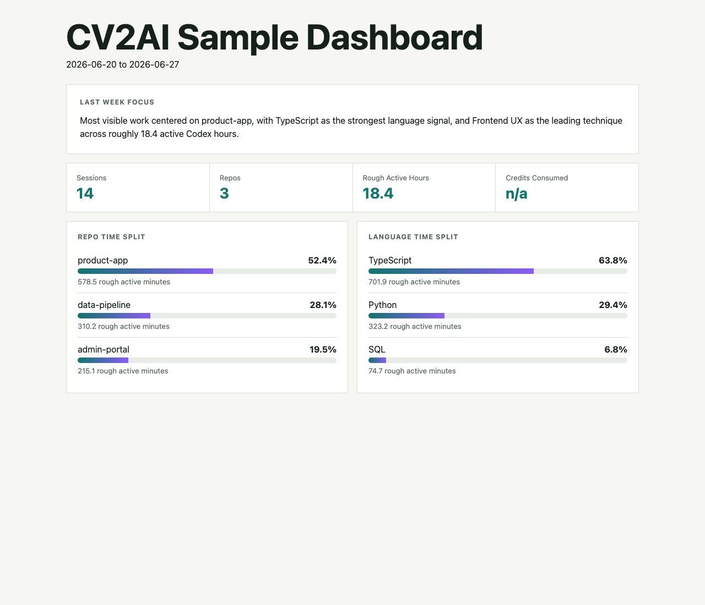

# CV2AI

CV2AI is a Codex skill that turns local Codex chat history into a resume/profile report and a static metrics dashboard.

It scans `~/.codex/sessions` and `~/.codex/archived_sessions`, detects touched repos, languages, techniques, packages, skills, rough active time, and token/credit consumption, then writes report artifacts under `~/.cv2ai-reports`.

## What It Produces

Each run creates a timestamped folder:

```text
~/.cv2ai-reports/cv2ai-YYYY-MM-DD_to_YYYY-MM-DD-YYYYMMDD-HHMMSS/
├── evidence.json
├── metrics.json
├── profile.md
└── webpage.html
```

The dashboard shows:

- Last-week focus summary
- Rough active-time percentage by repo
- Rough active-time percentage by language
- Rough active-time percentage by technique
- New technique signals vs kept-using technique signals
- Package/framework signals
- Credits consumed when Codex exposes numeric credits
- Token usage when credits are unavailable

The time allocation is intentionally rough. It is estimated from Codex session timestamp gaps and capped to avoid counting long idle periods as work.

## Install As A Codex Skill

For a user shell:

```bash
mkdir -p "${CODEX_HOME:-$HOME/.codex}/skills"
git clone git@github.com:bohui/cv2ai.git "${CODEX_HOME:-$HOME/.codex}/skills/cv2ai"
chmod +x "${CODEX_HOME:-$HOME/.codex}/skills/cv2ai/scripts/"*.sh
```

If the skill already exists:

```bash
cd "${CODEX_HOME:-$HOME/.codex}/skills/cv2ai"
git pull --ff-only
chmod +x scripts/*.sh
```

For an AI agent installing from this README:

1. Clone this repo into `${CODEX_HOME:-$HOME/.codex}/skills/cv2ai`.
2. Ensure `scripts/cv2ai_weekly.sh` and `scripts/install_weekly_cron.sh` are executable.
3. Run the validation command below.
4. Run `scripts/cv2ai_weekly.sh` once and report the output folder path plus the printed dashboard Markdown link.

## Run

Weekly/default window:

```bash
"${CODEX_HOME:-$HOME/.codex}/skills/cv2ai/scripts/cv2ai_weekly.sh"
```

The command prints a clickable dashboard target for scheduler/agent summaries:

```text
Dashboard link: [webpage.html](/absolute/path/to/.cv2ai-reports/.../webpage.html)
Focus summary: Most visible work centered on ...
```

Specific date range:

```bash
python3 "${CODEX_HOME:-$HOME/.codex}/skills/cv2ai/scripts/cv2ai_collect.py" \
  --since 2026-06-20 \
  --until 2026-06-27
```

All history:

```bash
python3 "${CODEX_HOME:-$HOME/.codex}/skills/cv2ai/scripts/cv2ai_collect.py" --span all
```

Open the newest dashboard on macOS:

```bash
open "$(ls -td "$HOME/.cv2ai-reports"/cv2ai-* | head -1)/webpage.html"
```

## Optional Weekly Cron

Install a Monday 09:00 cron entry:

```bash
"${CODEX_HOME:-$HOME/.codex}/skills/cv2ai/scripts/install_weekly_cron.sh"
```

Install with a custom cron schedule:

```bash
"${CODEX_HOME:-$HOME/.codex}/skills/cv2ai/scripts/install_weekly_cron.sh" "30 8 * * 1"
```

The cron entry runs `scripts/cv2ai_weekly.sh` and appends logs to:

```text
~/.cv2ai-reports/cv2ai-weekly.log
```

Inspect or remove the entry with:

```bash
crontab -l
crontab -e
```

## Use From Codex

After installation, ask:

```text
Use $cv2ai to analyze last week of my Codex history and show the generated dashboard path.
```

For prose polish:

```text
Use $cv2ai to analyze last week, then polish profile.md into resume-ready bullets.
```

Routine weekly use does not need an LLM rewrite. The collector deterministically generates `profile.md` and `webpage.html`.

Scheduler summaries should always include the generated dashboard link, for example:

```markdown
Dashboard: [webpage.html](/Users/example/.cv2ai-reports/cv2ai-2026-06-20_to_2026-06-27-20260627-090000/webpage.html)
```

## Validate

Basic script check:

```bash
python3 -m py_compile scripts/cv2ai_collect.py
./scripts/cv2ai_weekly.sh --output-dir /tmp/cv2ai-smoke-test
```

Optional Codex skill validation, if you have the `skill-creator` system skill:

```bash
python3 ~/.codex/skills/.system/skill-creator/scripts/quick_validate.py .
```

If that validator reports `ModuleNotFoundError: No module named 'yaml'`, install `PyYAML` in the Python environment you use for validation or run it from a venv.

## Sample Output

### Dashboard Preview



The image above is a sanitized sample rendered from [examples/sample-dashboard.html](examples/sample-dashboard.html), so users can see the dashboard shape directly in this README without opening a separate file.

Sanitized sample dashboard summary:

```text
Most visible work centered on product-app, with TypeScript as the strongest language signal,
and Frontend UX as the leading technique across roughly 18.4 active Codex hours.
New signals: Playwright, API Design. Continued signals: React, Next.js, Python.
```

Sanitized rough time allocation:

```text
Repo time split
- product-app: 52.4% (578.5 rough active minutes)
- data-pipeline: 28.1% (310.2 rough active minutes)
- admin-portal: 19.5% (215.1 rough active minutes)

Language time split
- TypeScript: 63.8% (701.9 rough active minutes)
- Python: 29.4% (323.2 rough active minutes)
- SQL: 6.8% (74.7 rough active minutes)

Technique time split
- Frontend UX: 17.2% (189.7 rough active minutes)
- API Design: 15.5% (170.9 rough active minutes)
- Playwright: 11.6% (127.4 rough active minutes)
- Data Analysis: 10.8% (118.2 rough active minutes)
```

See:

- [examples/sample-profile.md](examples/sample-profile.md)
- [examples/sample-metrics.json](examples/sample-metrics.json)
- [examples/sample-dashboard.html](examples/sample-dashboard.html)
- [examples/sample-dashboard.png](examples/sample-dashboard.png)

## Privacy Notes

CV2AI reads local Codex history and local package manifests. It does not call a remote API. The collector redacts common token shapes and skips image/base64 payloads, but you should still review generated reports before publishing them.

Do not commit real `~/.cv2ai-reports` output unless you have reviewed it for private repo names, private task details, secrets, and personal data.

## Repo Layout

This repository is itself the Codex skill root:

```text
cv2ai/
├── SKILL.md
├── agents/openai.yaml
├── references/report-contract.md
├── scripts/cv2ai_collect.py
├── scripts/cv2ai_weekly.sh
├── scripts/install_weekly_cron.sh
└── examples/
```
